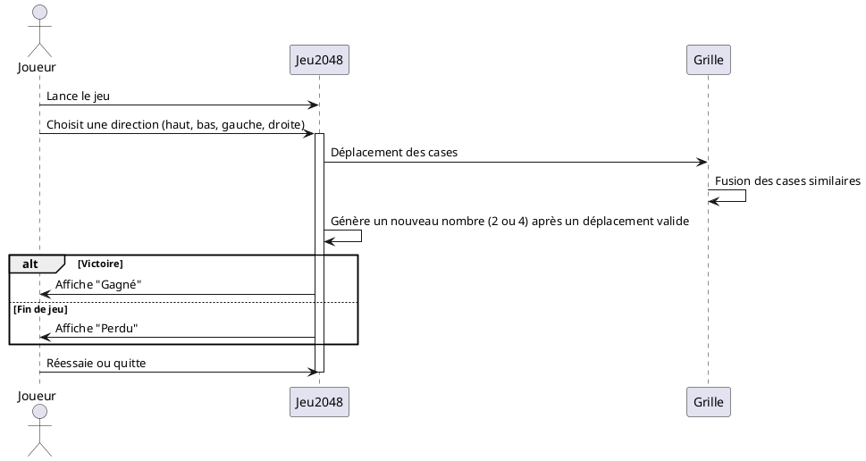
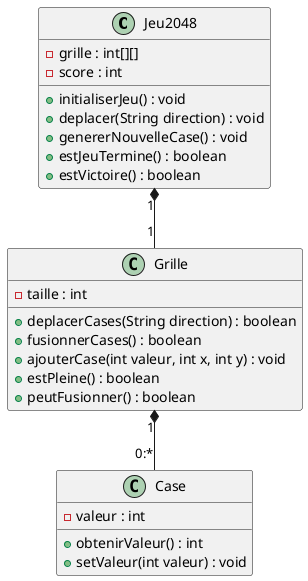

# Jeu 2048 en Java

## Concept du jeu

- **Grille de départ** : Le jeu commence avec une grille de 4x4 cases, et deux cases sont remplies avec 2 ou 4 (avec une plus grande probabilité d'avoir 2).
  
- **Déplacements et fusion des cases** : L'utilisateur peut choisir de déplacer les cases dans une direction (haut, bas, gauche, droite). Si deux cases adjacentes contiennent le même nombre, elles fusionnent en une seule case avec une valeur égale à leur somme. Par exemple, si deux cases de 2 sont adjacentes et qu'on les déplace, elles fusionnent pour donner une case de 4.

- **Génération de nouvelles cases** : Après chaque déplacement qui modifie la grille (si des cases ont bougé ou fusionné), une nouvelle case contenant 2 ou 4 est générée dans une case vide.

- **Condition de victoire** : Le joueur gagne la partie lorsqu'une case atteint la valeur de 2048.

- **Condition de fin de jeu** : Le jeu se termine si la grille est pleine et qu'il n'est plus possible de réaliser aucun mouvement ni fusion.

## Diagrammes

### Diagramme de séquence

### Diagramme de classes

